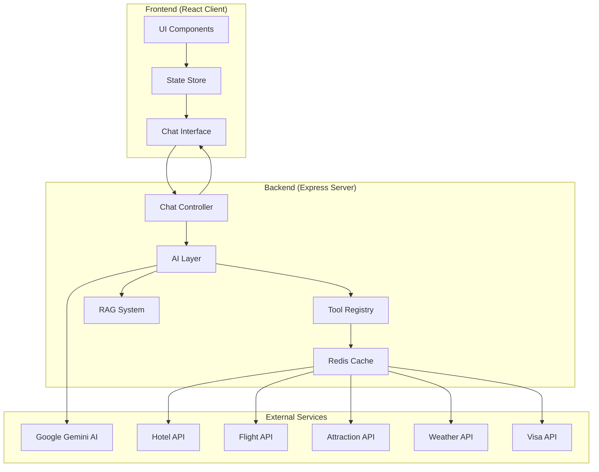
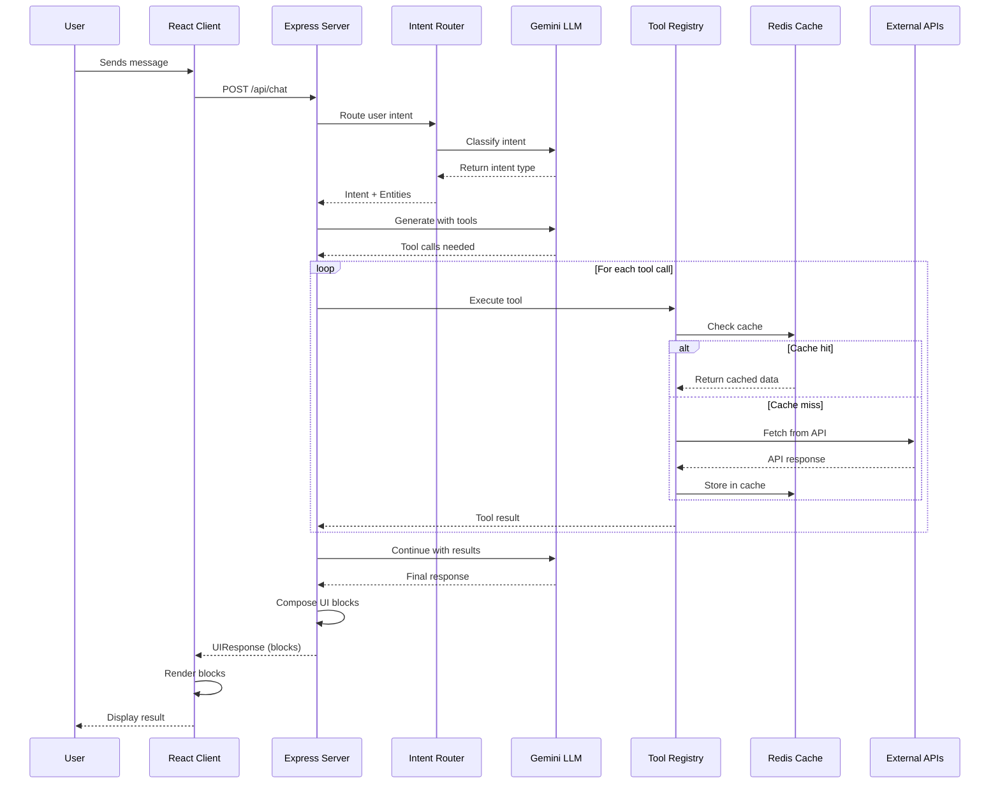
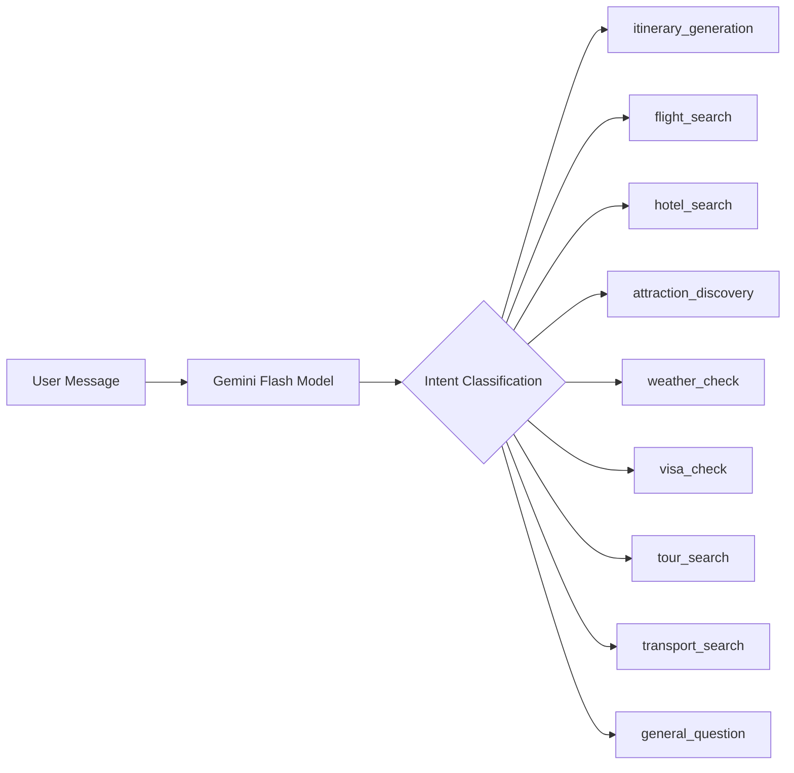
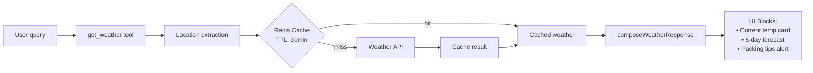
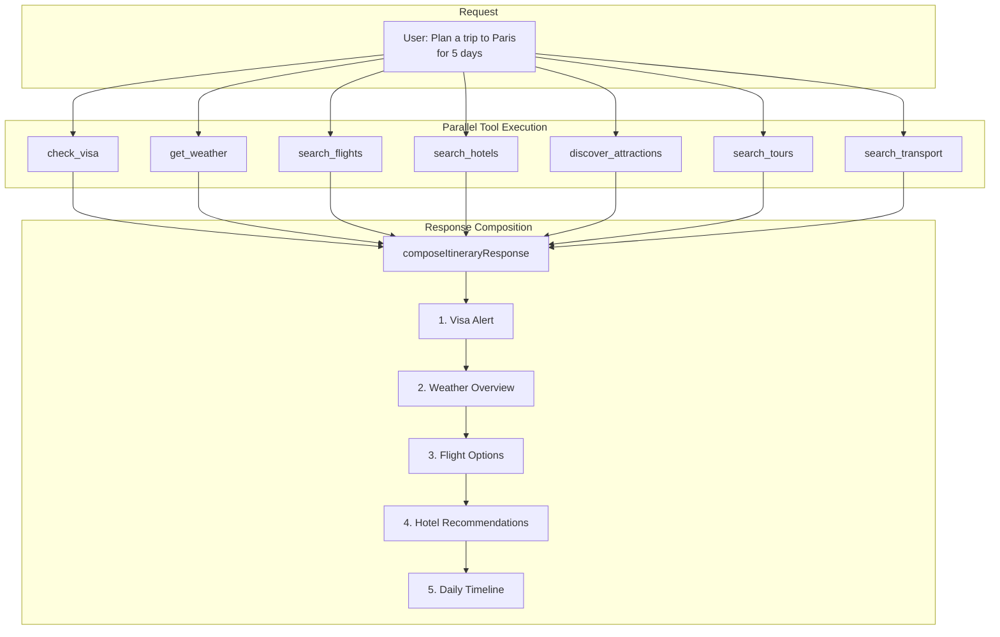
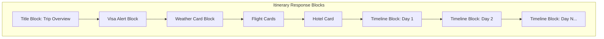
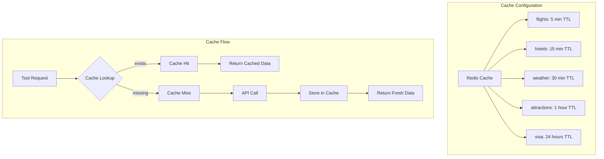
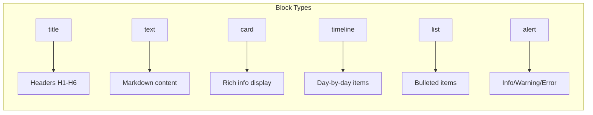
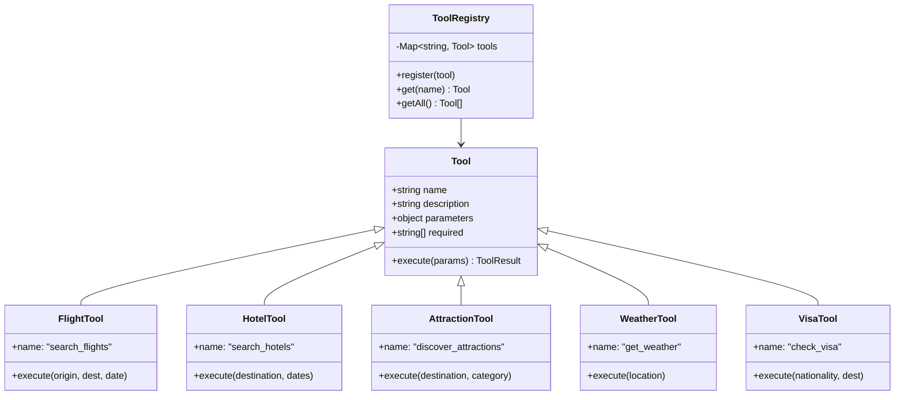

# AI Trip Planner - System Architecture

> **Complete technical documentation of how the system works**

---

## 📊 High-Level System Overview



---

## 🔄 Complete Request Flow



---

## 🧠 AI Processing Pipeline

### Intent Classification



### Intent to Tools Mapping

| Intent | Tools Called | Description |
|--------|--------------|-------------|
| `itinerary_generation` | All tools (parallel) | Full trip planning |
| `flight_search` | `search_flights` | Find flight options |
| `hotel_search` | `search_hotels` | Find accommodations |
| `attraction_discovery` | `discover_attractions` | Find things to do |
| `weather_check` | `get_weather` | Weather forecast |
| `visa_check` | `check_visa` | Visa requirements |
| `tour_search` | `search_tours` | Find guided tours |
| `transport_search` | `search_transport` | Local transportation |

---

## ✈️ Flight Search Flow

```mermaid
flowchart TB
    subgraph "User Request"
        A[User: "Find flights to Paris"]
    end
    
    subgraph "Intent Processing"
        B[Intent: flight_search]
        C[Entities: destination=Paris]
    end
    
    subgraph "Tool Execution"
        D[search_flights tool]
        E{Check Redis Cache}
        F[Cache Hit] --> G[Return cached flights]
        H[Cache Miss] --> I[Call Flight API]
        I --> J[Store in Redis 5min TTL]
        J --> K[Return flight data]
    end
    
    subgraph "Response Composition"
        L[composeFlightResponse]
        M[Generate Card Blocks]
        N["UI: Flight cards with<br/>airline, price, duration"]
    end
    
    A --> B --> D
    D --> E
    E -->|hit| F
    E -->|miss| H
    G --> L
    K --> L
    L --> M --> N
```

### Flight Data Structure

```typescript
interface FlightData {
    id: string;
    airline: string;           // "Emirates"
    flightNumber: string;      // "EK-512"
    departure: string;         // "10:30 AM"
    arrival: string;           // "4:00 PM"
    duration: string;          // "5h 30m"
    price: string;             // "$450"
    stops: number;             // 0
    aircraft: string;          // "Boeing 777-300ER"
    class: string;             // "Economy"
}
```

---

## 🏨 Hotel Search Flow

```mermaid
flowchart TB
    subgraph "User Request"
        A[User: "Hotels in Tokyo"]
    end
    
    subgraph "Tool Execution"
        B[search_hotels tool]
        C[Parameters: destination, dates, guests]
        D{Redis Cache Check}
        E[API Call or Fallback Data]
    end
    
    subgraph "Response Processing"
        F[composeHotelResponse]
        G["Generate Card blocks with:<br/>• Hotel name & rating<br/>• Price per night<br/>• Amenities list<br/>• Book Now action"]
    end
    
    A --> B --> C --> D
    D --> E --> F --> G
```

### Hotel Data Structure

```typescript
interface HotelData {
    id: string;
    name: string;              // "Grand Hyatt Tokyo"
    location: string;          // "Shinjuku District"
    rating: number;            // 4.8
    price: string;             // "$320/night"
    image: string;             // URL
    amenities: string[];       // ["WiFi", "Pool", "Spa"]
    description: string;
}
```

---

## 🏛️ Attraction Discovery Flow

```mermaid
flowchart TB
    subgraph "Request"
        A[User: "Things to do in Bali"]
    end
    
    subgraph "Processing"
        B[discover_attractions tool]
        C["Extract: destination, category"]
        D[Destination-specific fallback data]
        E["Filter by category (if provided)"]
    end
    
    subgraph "Response"
        F[composeAttractionResponse]
        G["Card blocks for each attraction:<br/>• Name & category<br/>• Rating & duration<br/>• Price (if applicable)<br/>• Image"]
    end
    
    A --> B --> C --> D --> E --> F --> G
```

### Supported Destinations

| Destination | Sample Attractions |
|-------------|-------------------|
| Thailand | Grand Palace, Floating Markets |
| Delhi | India Gate, Red Fort, Qutub Minar |
| Mumbai | Gateway of India, Marine Drive |
| Goa | Baga Beach, Scuba Diving |
| Jaipur | Amber Fort, Hawa Mahal |
| Japan | Fushimi Inari, Tokyo Skytree |
| Default | City Walking Tour, Old Town District |

---

## 🌤️ Weather Check Flow



### Weather Data Structure

```typescript
interface WeatherData {
    location: string;
    current: {
        temp: string;          // "28°C"
        condition: string;     // "Sunny"
    };
    forecast: Array<{
        date: string;          // "Mon, Jan 21"
        high: string;          // "30°C"
        low: string;           // "24°C"
        condition: string;     // "Partly Cloudy"
    }>;
}
```

---

## 📋 Visa Check Flow

```mermaid
flowchart TB
    subgraph "Input"
        A[User: "Do I need visa for Thailand?"]
        B["Extract: nationality, destination"]
    end
    
    subgraph "Processing"
        C[check_visa tool]
        D{RAG System}
        E[Travel regulations docs]
        F[Visa requirement lookup]
    end
    
    subgraph "Response"
        G[composeVisaResponse]
        H["Alert blocks:<br/>• Success/Warning level<br/>• Visa type info"]
        I["List block:<br/>• Required documents"]
        J["Alert block:<br/>• Additional warnings"]
    end
    
    A --> B --> C
    C --> D --> E
    D --> F --> G
    G --> H --> I --> J
```

### Visa Response Types

| Visa Status | Alert Level | Example |
|-------------|-------------|---------|
| Visa Free | `success` | "No visa required!" |
| Visa on Arrival | `success` | "VOA available for 15-30 days" |
| E-Visa Required | `warning` | "Apply online before travel" |
| Embassy Visa | `warning` | "Visit embassy in advance" |

---

## 📅 Itinerary Generation Flow



### Itinerary UI Structure



---

## 💾 Caching Architecture



### Cache Key Generation

```typescript
// Example cache keys
"flights:delhi:paris:2024-03-15:economy"
"hotels:tokyo:2024-03-10:2024-03-15:2"
"weather:bali"
"attractions:thailand:temple"
"visa:indian:thailand"
```

---

## 📱 UI Block Types



### Block Type Reference

| Type | Use Case | Key Properties |
|------|----------|----------------|
| `title` | Section headers | `text`, `level` |
| `text` | Markdown content | `content`, `format` |
| `card` | Hotels, Flights | `title`, `subtitle`, `meta`, `badge`, `actions` |
| `timeline` | Itinerary days | `title`, `items[]` with time/icon/status |
| `list` | Requirements | `title`, `items[]` with text/icon |
| `alert` | Warnings/Info | `level`, `title`, `text` |

---

## 🔧 Tool Registry Architecture



---

## 📁 Project Structure

```
ai-trip-planning/
├── client/                    # React Frontend
│   └── src/
│       ├── components/        # UI Components
│       │   ├── atoms/         # Basic elements
│       │   ├── molecules/     # Composite elements
│       │   └── organisms/     # Complex layouts
│       ├── pages/             # Page components
│       ├── store/             # State management
│       ├── types/             # TypeScript types
│       └── data/              # Mock data
│
└── server/                    # Express Backend
    └── src/
        ├── api/               # API Controllers
        │   └── chat.controller.ts
        ├── ai/                # AI Layer
        │   ├── llm-client.ts      # Gemini integration
        │   ├── intent-router.ts   # Intent classification
        │   ├── response-composer.ts
        │   └── system-prompt.ts
        ├── tools/             # Service Tools
        │   ├── flight.tool.ts
        │   ├── hotel.tool.ts
        │   ├── attraction.tool.ts
        │   ├── weather.tool.ts
        │   ├── visa.tool.ts
        │   ├── tour.tool.ts
        │   └── transport.tool.ts
        ├── cache/             # Redis Caching
        │   └── redis.ts
        ├── rag/               # RAG System
        │   ├── embeddings.ts
        │   ├── loader.ts
        │   └── retriever.ts
        ├── schema/            # UI Schema
        │   └── ui-schema.zod.ts
        └── server.ts          # Entry point
```

---

## 🚀 API Endpoints

| Endpoint | Method | Description |
|----------|--------|-------------|
| `/api/chat` | POST | Main chat endpoint |
| `/api/chat/stream` | POST | SSE streaming endpoint |
| `/health` | GET | Health check |

### Chat Request/Response

```typescript
// Request
interface ChatRequest {
    message: string;
    conversationHistory?: Array<{
        role: 'user' | 'assistant';
        content: string;
    }>;
}

// Response
interface UIResponse {
    blocks: UIBlock[];
}
```

---

## 🎯 Summary

The AI Trip Planner works through a pipeline:

1. **User sends message** → Frontend React app
2. **Intent classification** → Gemini AI determines what user wants
3. **Tool selection** → System picks appropriate tools (flight, hotel, etc.)
4. **Parallel execution** → Tools fetch data with Redis caching
5. **Response composition** → Tool results → UI blocks
6. **Rendering** → Frontend displays cards, timelines, alerts

**Key Features:**
- 🧠 AI-powered intent understanding
- ⚡ Redis caching for performance
- 🔄 Fallback data when APIs unavailable
- 📊 Schema-driven UI rendering
- 🎨 Rich visual components
